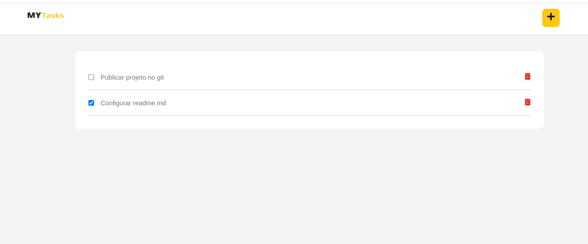

#  Todo

Criando um simples TODO

* React
* styled-components
* typescript
* Context Api 
* React-hook-Form
* Yup 

## Aprendizado

Entendo o uso do Context Api e a facilidade de se trabalhar utilizando o react-hoot-forms 
junto do yup.

## List 
 

## Adicionar

